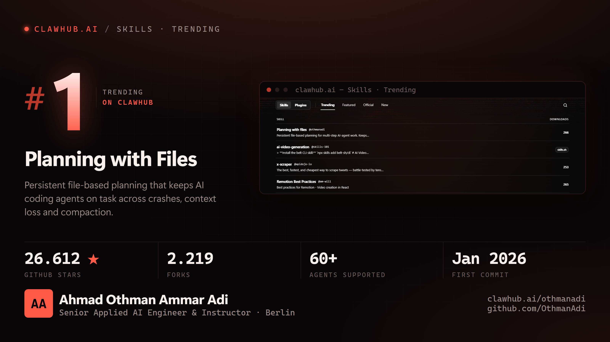

# celebrate

**Turn a real win into a set of posting-ready image assets, built around the proof.**

You hit #1 on a leaderboard. You crossed 25.000 stars. Your paper got in, your
release shipped, your revenue chart turned. You have a screenshot, and a screenshot
is the wrong shape for every channel you want to put it on: it is cropped for a
monitor, it carries your bookmark bar, its dark interface turns to mud the moment a
feed re-encodes it, and it says nothing about who did the work.

`celebrate` is an agent skill that takes that moment and produces the assets:
correct pixel sizes per platform, retina, the proof embedded and legible, verified
numbers beside it, your name attached.



## Install

For Claude Code, as a personal skill:

```bash
git clone https://github.com/OthmanAdi/celebrate ~/.claude/skills/celebrate
```

Or into a project, at `.claude/skills/celebrate`. Any agent that reads `SKILL.md`
files can use it; nothing here is Claude-specific except the frontmatter.

Requires Python 3.8+, Pillow, and Chrome, Chromium or Edge. The renderer finds the
browser itself; override with `CELEBRATE_CHROME`.

## Use

Say what happened:

> I'm trending #1 on clawhub.ai, make me something I can post

The skill then captures or takes the proof, verifies every number against a live
source, crops the screenshot, renders the set, and writes the captions.

## Or run it directly

```bash
# 1. crop the proof out of a raw screenshot, keeping the original untouched
python scripts/prepare_proof.py shot.png --out proof/ \
       --crop 600,352,1640,658 --ref-width 1998

# 2. describe the win
cp templates/celebration.json ./celebration.json && $EDITOR celebration.json

# 3. render
python scripts/render_cards.py --config celebration.json --out ./social
```

## What comes out

| Key | Size | For |
|---|---|---|
| `x` | 1600 x 900 | X / Twitter in-feed |
| `linkedin` | 1200 x 627 | LinkedIn in-feed, and OpenGraph |
| `square` | 1080 x 1080 | Instagram, Mastodon |
| `story` | 1080 x 1920 | Story, Reel cover, Short |
| `email-banner` | 1200 x 400 | Newsletter header |
| `linkedin-cover` | 1584 x 396 | LinkedIn profile background |
| `github-social` | 1280 x 640 | Repo social preview |
| `slide` | 1920 x 1080 | Deck, screen share |

Every file is captured at 2x. If the config carries a call to action, each format is
rendered twice, once with it and once without, because someone currently employed
may want the achievement post without an availability line on it. That choice is
the author's, not the tool's.

## Why it is built this way

Three decisions do most of the work.

**The proof is evidence, so it is handled like evidence.** The untouched original
ships in the folder. The derivative is cropped and brightened, and nothing else is
done to it. Brightening is not vanity: a near-black product interface is legible on
your monitor and unreadable after a feed re-encodes it.

**Every number is pulled live at build time.** Not from memory, not from a note.
A rounded-up star count is the easiest thing in the world for a sceptic to catch,
and catching it discredits every other number on the card.

**Layout is fitted, not budgeted.** A pass in the page measures overflow in both
axes and scales the whole card down until it fits, so a longer name or a fifth stat
shrinks the design instead of clipping it. Per-format pixel budgets work right up
until the copy changes.

## Documentation

| File | What is in it |
|---|---|
| [`SKILL.md`](SKILL.md) | The procedure, in order |
| [`references/formats.md`](references/formats.md) | Every size, and how to pick |
| [`references/design.md`](references/design.md) | Tokens, anatomy, the giant-numeral rules |
| [`references/rendering.md`](references/rendering.md) | Headless capture, the fit pass, and the real bugs |
| [`references/proof.md`](references/proof.md) | What to crop, what to remove |
| [`references/verify.md`](references/verify.md) | Where each number comes from |
| [`references/copy.md`](references/copy.md) | Headline, stats and caption formulas |
| [`examples/`](examples/clawhub-number-1) | A complete run, config and output |

## Licence

MIT.
